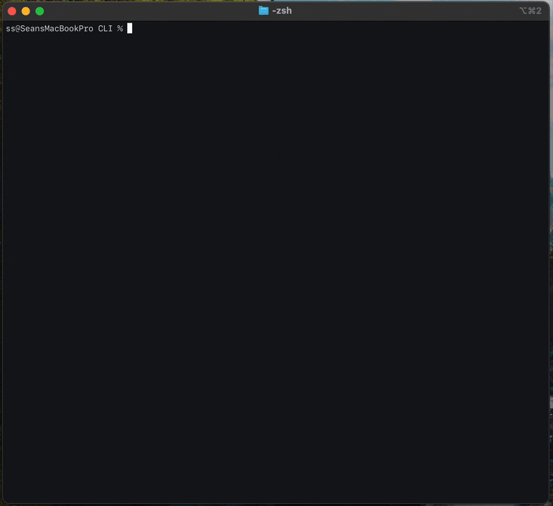

# Capsule CLI

Terminal client for [Capsule](https://withcapsule.dev) that supports file encryption, local history, and custom server configurations.


## Encryption



`upload-encrypted` encrypts the file on your device using [`age`](https://age-encryption.org) before it is sent to the server. The server stores only the encrypted bytes and never sees the plaintext. A 12-word BIP39 mnemonic is generated and displayed on upload — give it to the recipient alongside the file ID. If you lose the mnemonic, the file cannot be recovered.

```sh
capsule upload-encrypted report.pdf
# → File ID: aB3xZ9Qr
# → Mnemonic: word word word word word word word word word word word word

# will prompt for mnemonic, decrypts on device
capsule download aB3xZ9Qr
```

## Install

**MacOS & Linux (via Homebrew)**
```sh
brew install capsule
```

**Fedora Linux 43+ (via COPR)**
```sh
sudo dnf copr enable seanathan/capsule
sudo dnf install capsule
```

**From source**
```sh
cargo build --release
./target/release/capsule --help
```


## Usage examples

```sh
# Upload a file
capsule u photo.jpg

# Upload with encryption (generates a 12-word key)
capsule ue secret.pdf

# Download by ID or full URL
capsule download aB3xZ9Qr
capsule d https://send.withcapsule.dev/aB3xZ9Qr

# Download to a specific path
capsule download aB3xZ9Qr --output ~/Downloads/photo.jpg

# Check on a file's remaining time
capsule status aB3xZ9Qr

# View recent transfers
capsule recents
```

<!--## Shell completions

Each shell has a dedicated completions directory it sources automatically — no rc file edits needed.

**Bash**
```sh
capsule completions bash > ~/.local/share/bash-completion/completions/capsule
```

**Zsh**
```sh
mkdir -p ~/.zfunc
capsule completions zsh > ~/.zfunc/_capsule
```
Then add these two lines to `~/.zshrc` once (if not already present):
```sh
fpath=(~/.zfunc $fpath)
autoload -Uz compinit && compinit
```

**Fish** (auto-sourced, no setup needed)
```sh
capsule completions fish > ~/.config/fish/completions/capsule.fish
```

**PowerShell**
```powershell
capsule completions powershell > "$HOME/Documents/PowerShell/completions/capsule.ps1"
. "$HOME/Documents/PowerShell/completions/capsule.ps1"
```-->
